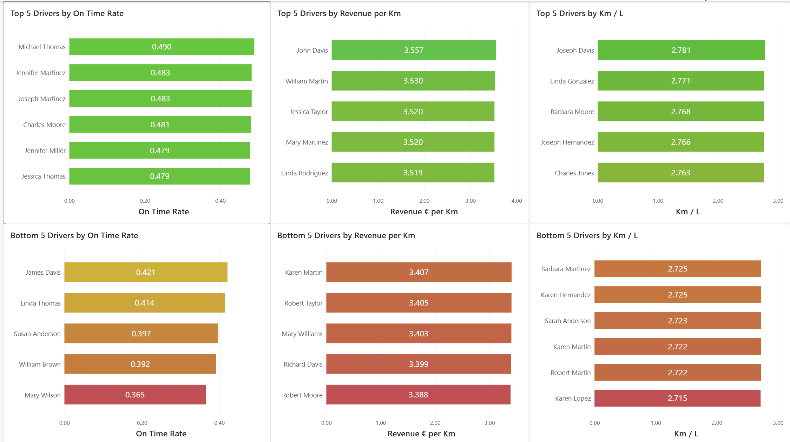
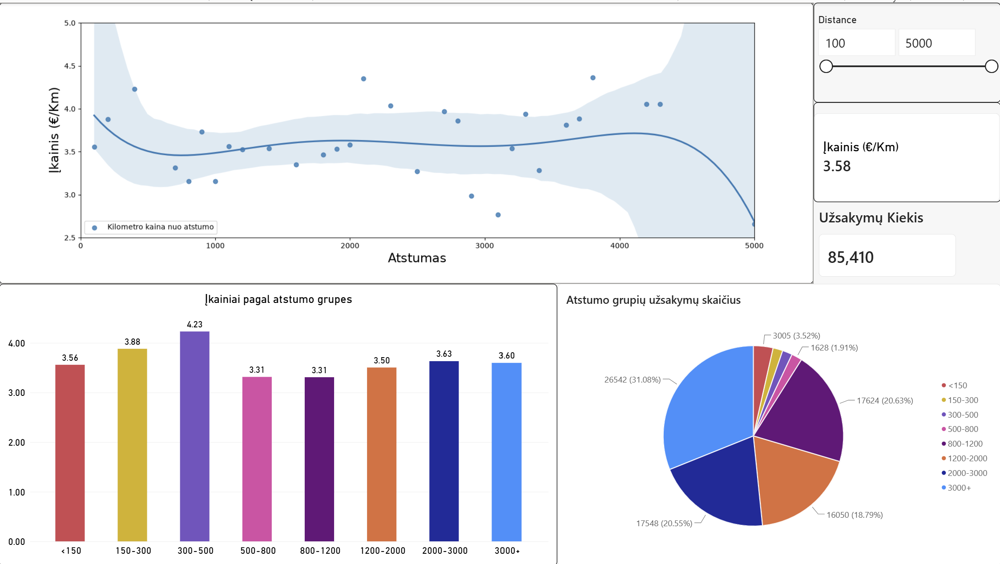
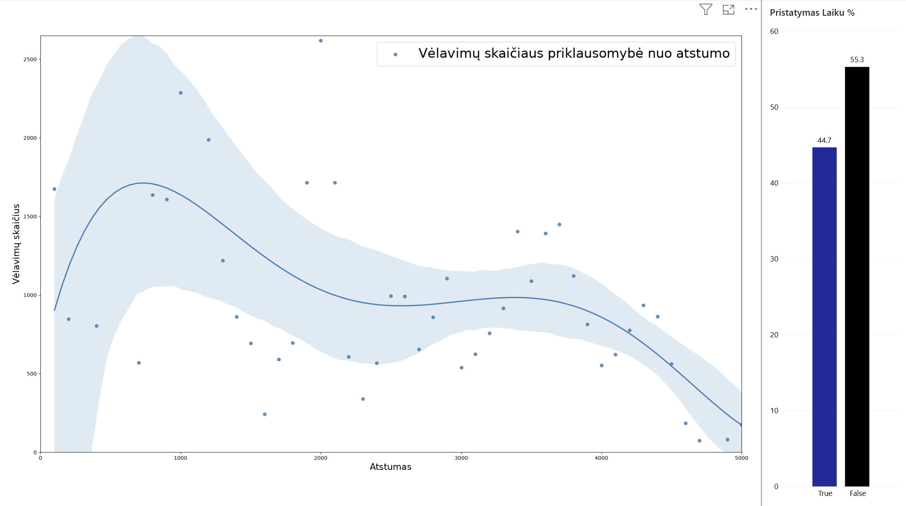
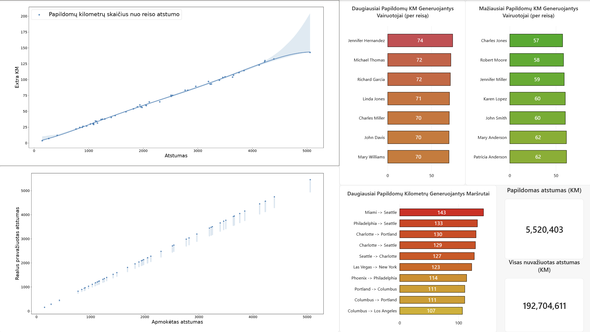

# Logistics Company Data Analysis

## 📊 Project Overview

This project analyzes logistics company data to identify trends and patterns related to operational performance, revenue, delivery efficiency, driver performance, route distance, safety incidents, and fleet maintenance.

The project was completed as part of my Data Analytics studies at Vilnius Coding School.

My previous professional background in transport and logistics helped me approach the dataset from a business perspective and focus on metrics relevant to real-world logistics operations.

## 🛠️ Tools & Technologies

- **SQL (MySQL)** – data extraction, joins, aggregations, CTEs, window functions and data preparation
- **Python** – data analysis and transformation
- **Pandas** – data manipulation and aggregation
- **Matplotlib & Seaborn** – data visualization and trend analysis
- **Power BI** – interactive dashboards and KPI visualization

## 🔍 Analysis Areas

The project covers several areas of logistics operations:

- Seasonal customer and revenue analysis
- Driver performance analysis
- Revenue per distance analysis
- Delivery performance and on-time delivery rates
- Extra distance driven compared with planned route distance
- Traffic accident analysis
- Fleet maintenance and service analysis

## 🐍 Python & SQL Analysis

The Python notebook combines SQL queries with Python-based data analysis.

SQL was used to extract and aggregate data from the MySQL database using techniques including:

- Common Table Expressions (CTEs)
- JOINs
- GROUP BY and aggregate functions
- CASE statements
- Window functions
- Date functions

Python and Pandas were then used for further data transformation, analysis and visualization.

➡️ [View Python analysis](notebooks/logistics-analysis.ipynb)

## 📈 Power BI Dashboard

Power BI was used to create interactive dashboards to visualize key logistics performance indicators and explore operational patterns.

### Driver Performance

Analysis of driver-related performance metrics and operational results.

### Revenue & Route Distance

Analysis of the relationship between route distance and revenue performance.

### On-Time Delivery Performance

Analysis of delivery performance across different route distances.

### Extra Distance Analysis

Analysis of additional distance driven compared with the originally planned route distance.

The complete interactive Power BI report is available below:

➡️ [Download Power BI dashboard](powerbi/logistics-dashboard.pbix)

## 💡 Key Findings

The analysis explored relationships between route distance, revenue, delivery performance and operational efficiency.

Key observations from the project will be summarized here together with dashboard visualizations.

## 📁 Repository Structure

    logistics-data-analysis/
    │
    ├── notebooks/
    │   └── logistics-analysis.ipynb
    │
    ├── powerbi/
    │   └── logistics-dashboard.pbix
    │
    └── README.md

## 👤 About This Project

This project was created as a portfolio project after completing Data Analytics training at Vilnius Coding School.

It demonstrates practical use of SQL, Python and Power BI for analyzing logistics and transportation data.
